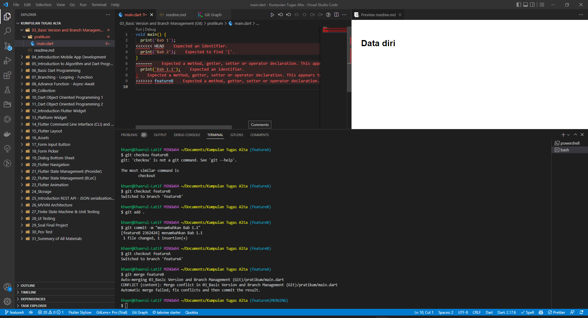
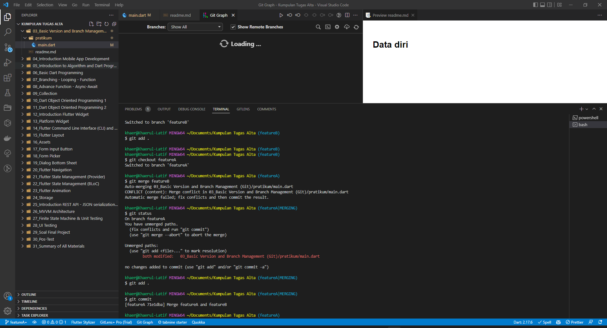
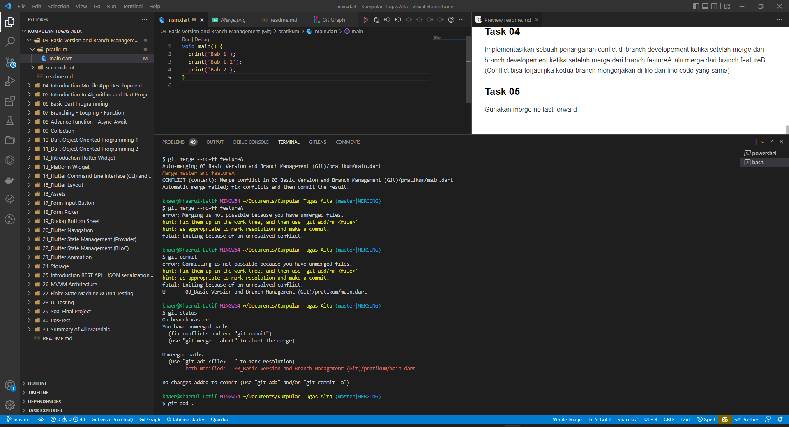

# (03) Basic Version and Branch Management (Git)
## Data diri 
Nomor Peserta : 1_013FLB_50  
Nama Peserta : Khaerul Latif

## Summary 
Section 03 ini saya belajar tentang Basic Version and Branch Management (Git), diantaranya:
1. Cara membuat repository di github
2. Cara meremote github menggunakan GIT
3. Cara mengabungkan beberapa branch

## Task
### Task 01
Buat sebuah repository di Github
.png)

### Task 02
Implementasikan penggunaan branching yang terdiri dari master, development, featureA, dan featureB
.png)

### Task 03
Implementasikan intruksi git untuk push, pull, stash dan merge
* Push

* Pull

* Merge

### Task 04
Implementasikan sebuah penanganan confict di branch developement ketika setelah merge dari branch developement ketika setelah merge dari branch featureA lalu merge dari branch featureB (Conflict bisa terjadi jika kedua branch mengerjakan di file dan line code yang sama)
* Conflict Merge

### Task 05
Gunakan merge no fast forward
* Merge No Forward
