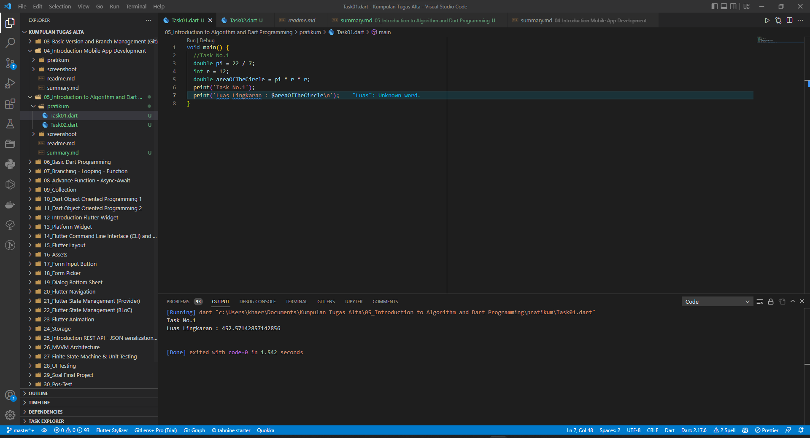
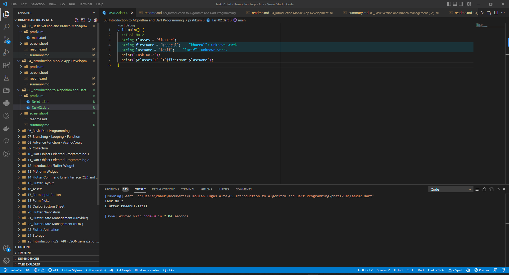

# (05) Introduction to Algorithm and Dart Programming
## Data diri 
Nomor Peserta  : 1_013FLB_50
Nama : Khaerul Latif

## Summary 
Section 7 ini saya belajar tentang Introduction to Algorithm and Dart Programming, diantaranya:
1. Mengetahui 
2. Mengetahui Operator yang terdapat di bahasa pemrograman Dart
3. Mengetahui Tipe Data yang terdapat di bahasa pemrograman Dart

## Task
### Task 01
Implementasikan rumus luas lingkaran pada program Dart!
Penjelasannya:
menambahkan variable r(jari-jari) dengan tipe data integer, serta dengan nilai variable 12. dan menambahkan variable pi dengan tipe data double, serta dengan nilai variable 22 / 7. untuk prosesnya mencari luas lingkaran itu menggunakan variable areaOfTheCircle dengan tipe data double

### Task 02
Buatlah 3 buah variabel yang berisi string, lalu sambungkan seluruh string tersebut, dan tampilkan pada layar!
Penjelasannya:
membuat 3 variable dengan nama classes, firstName & last name  tipe data String . lalu mengabungkan String dengan menambahkan simbol '$' diletakkkan di depan variable dan menggunakan simbol '+'
