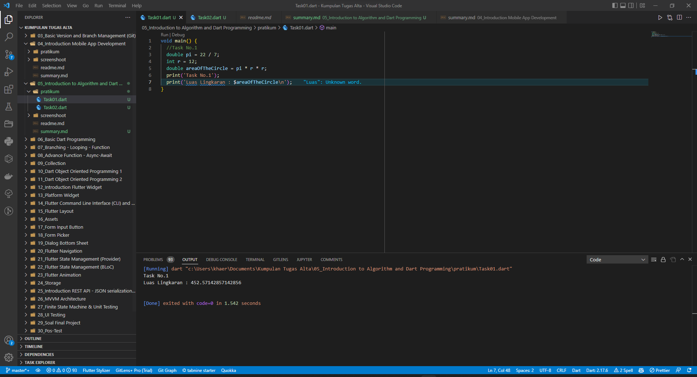
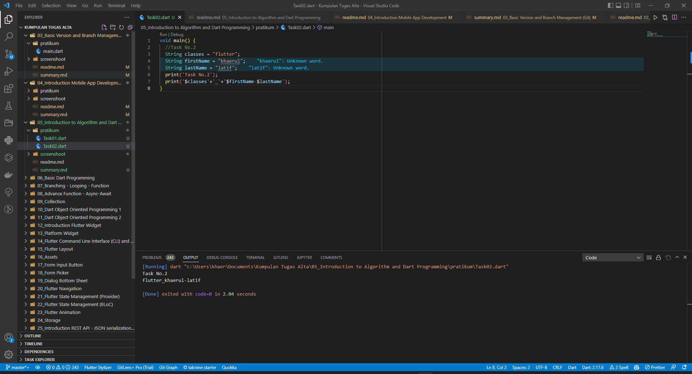

# (05) Introduction to Algorithm and Dart Programming
## Data diri 
Nomor Peserta  : 1_013FLB_50
Nama : Khaerul Latif

## Summary 
Section 5 ini saya belajar tentang Introduction to Algorithm and Dart Programming, diantaranya:
1. Mengetahui menggunakan dart di editor Visual Studio Code
2. Mengetahui Operator yang terdapat di bahasa pemrograman Dart
3. Mengetahui Tipe Data yang terdapat di bahasa pemrograman Dart

## Task
### Task 01
Implementasikan rumus luas lingkaran pada program Dart!

### Task 02
Buatlah 3 buah variabel yang berisi string, lalu sambungkan seluruh string tersebut, dan tampilkan pada layar!
