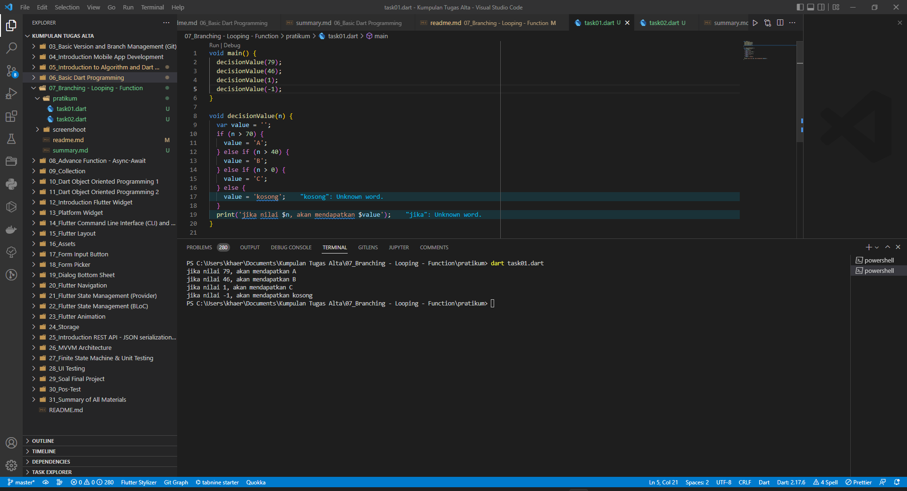
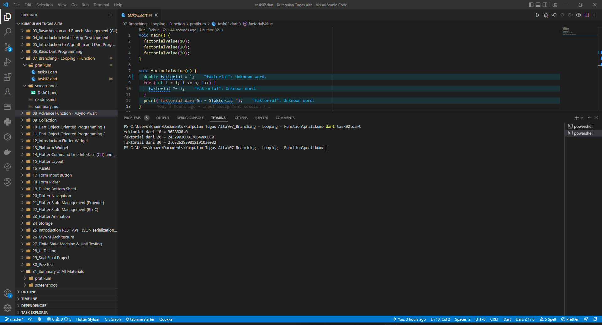

# (07) Branching - Looping - Function
## Data diri 
Nomor Peserta  : 1_013FLB_50   
Nama : Khaerul Latif

## Summary 
Section 7 ini saya belajar tentang Branching - Looping - Function, diantaranya:
1. Mengetahui cara perulangan di bahasa pemrograman Dart
2. Mengetahui cara menangambil keputusan di bahasa pemrograman Dart
3. Mengetahui cara menghentikan dan melanjutkan perulangan di bahasa pemrograman Dart

## Task
### Task 01
Menampilakan nilai jika:
- nilai diatas 70 akan mendapatkan A
- nilai diatas 40 akan mendapatkan B
- nilai diatas 0 akan mendapatkan C 
- nilai selain itu akan mendapatkan kosong(null)

### Task 02
menampilakan nilai faktorial dari:
- 10
- 20
- 30

