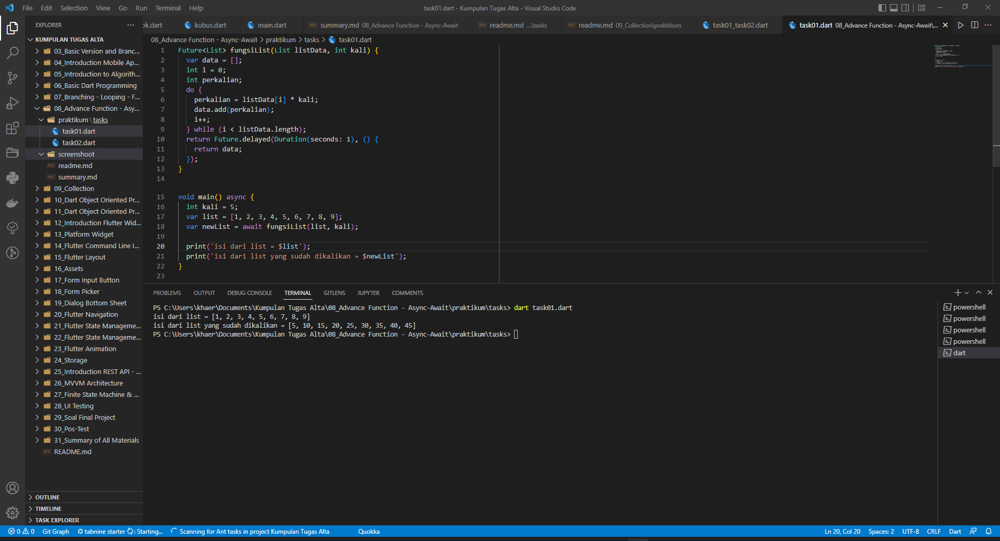
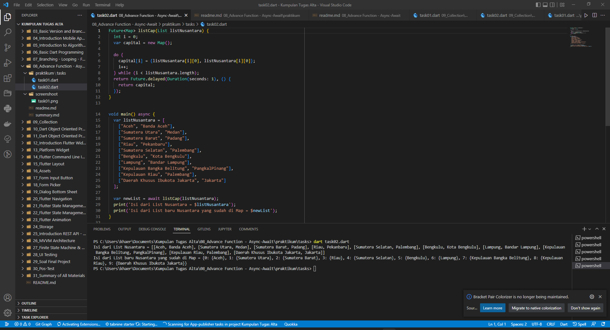

# (08) Advance Function - Async-Await
## Data diri 
Nomor Peserta  : 1_013FLB_50   
Nama : Khaerul Latif

## Summary 
Section 8 ini saya belajar tentang Advance Function - Async-Await, diantaranya:
1. Dalam asynchronous program memungkinkan suatu operasi bisa berjalan sembari menunggu operasi lainnya selesai.
2. Future adalah sebuah objek yang mewakili nilai potensial atau kesalahan yang akan tersedia pada waktu mendatang.
3. Metode delayed pada objek Future berfungsi untuk menunda jalannya operasi kode bergantung dengan durasi yang ditentukan.

## Task
### Task 01
1. Membuat sebuah fungsi dengan spesifikasi berikut:
- menerima 2 parameter, yaitu list data dan pengali, 
- lakukan perulangan pada list data secara asynchronous, 
- tiap perulangan, kalikan elemen list data dengan pengali, 
- return list baru yang berisi hasil proses di atas.

### Task 02
2. Membuat sebuah list dengan spesifikasi berikut & Membuat sebuah Map dengan menggunakan list tersebut!:
- tiap element-nya berupa list juga, 
- tiap element wajib terdapat 2 data (sub-element). 

