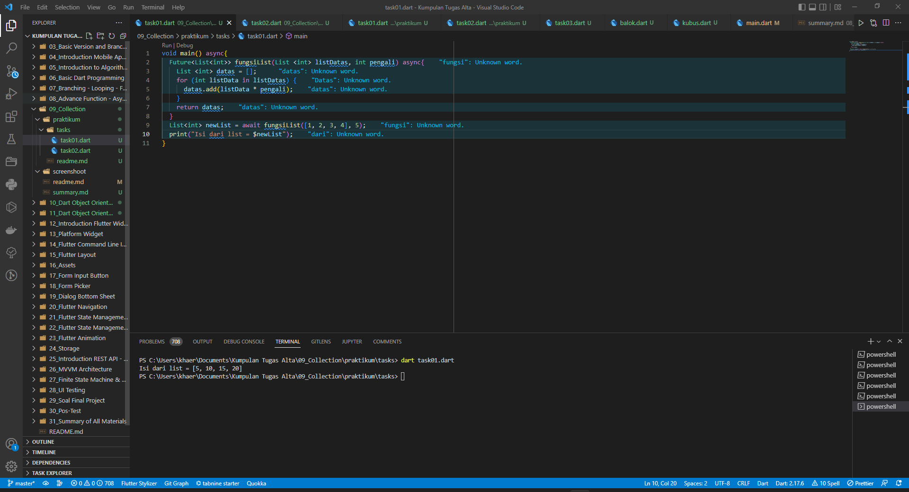
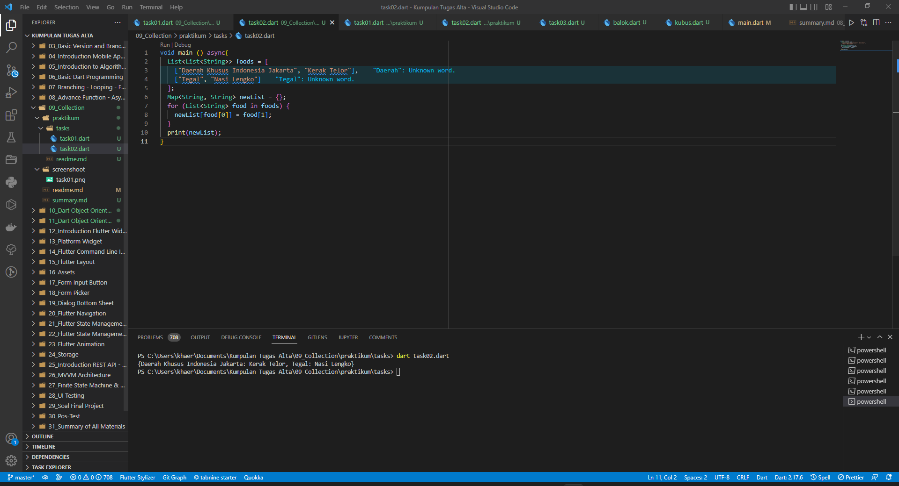

# (09) Collection
## Data diri 
Nomor Peserta  : 1_013FLB_50   
Nama : Khaerul Latif

## Summary 
Section 9 ini saya belajar tentang Collection, diantaranya:
1. List digunakan untuk menyimpan banyak data. Data pada List disusun secara berurutan dan diakses menggunakan index.
2. Set digunakan untuk menyimpan banyak data secara unik, tidak ada duplikasi, tidak berurutan, dan tidak diindeks.
3. Map menyimpan banyak data dengan format pasangan key-value

## Task
### Task 01
1. Membuat sebuah fungsi dengan spesifikasi berikut:
- menerima 2 parameter, yaitu list data dan pengali, 
- lakukan perulangan pada list data secara asynchronous, 
- tiap perulangan, kalikan elemen list data dengan pengali, 
- return list baru yang berisi hasil proses di atas.

### Task 02
2. Membuat sebuah list dengan spesifikasi berikut & Membuat sebuah Map dengan menggunakan list tersebut!:
- tiap element-nya berupa list juga, 
- tiap element wajib terdapat 2 data (sub-element). 

