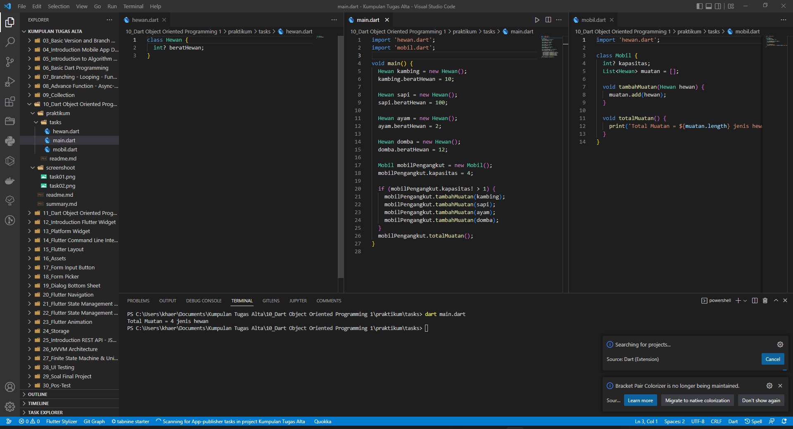

# (10) Dart Object Oriented Programming 1

## Data diri

Nomor Peserta : 1_013FLB_50 <br />
Nama : Khaerul Latif

## Summary

Section 10 ini saya belajar tentang Dart Object Oriented Programming 1, diantaranya:

1. OOP merupakan paradigma yang berdasarkan pada konsep objek yang memiliki atribut serta dapat melakukan operasi atau prosedur tertentu.
2. Class merupakan blueprint untuk mendefinisikan karakteristik dari sebuah objek.
3. Property merepresentasikan atribut pada sebuah objek sementara Method menggambarkan perilaku dari objek.

## Task

### Task 01

Membuat beberapa class dengan rangkaian berikut ini!
* kelas hewan dengan properti beratHewan(int)

```dart
class Hewan {
  int? beratHewan;
}
```

* kelas mobil dengan properti kapasitas(int) dan muatan(List). serta mempunyai method tambahMuatan

```dart
 int? kapasitas;
 List<Hewan> muatan = [];

 void tambahMuatan(Hewan hewan) {
    muatan.add(hewan);
  }
```
* kelas main untuk menetukan apakah kapasitas mencukupi, maka akan di tambahkan pada list muatan
```dart
 if (mobilPengangkut.kapasitas! > 1) {
  }
```

### Task 02
membuat class main dan menambahkan method totalMuatan pada kelas mobil untuk menghitung total muatan yang di angkut mobil dan mencetak total muatan tersebut
```dart
// pada kelas mobil
Mobil mobilPengangkut = new Mobil();
mobilPengangkut.kapasitas = 4;

if (mobilPengangkut.kapasitas! > 1) {
    mobilPengangkut.tambahMuatan(kambing);
    mobilPengangkut.tambahMuatan(sapi);
    mobilPengangkut.tambahMuatan(ayam);
    mobilPengangkut.tambahMuatan(domba);
  }
mobilPengangkut.totalMuatan();
```
```dart
// pada kelas mobil
void totalMuatan() {
    print('Total Muatan = ${muatan.length} jenis hewan');
  }
```

Berikut adalah codingan dan hasil run programnya

