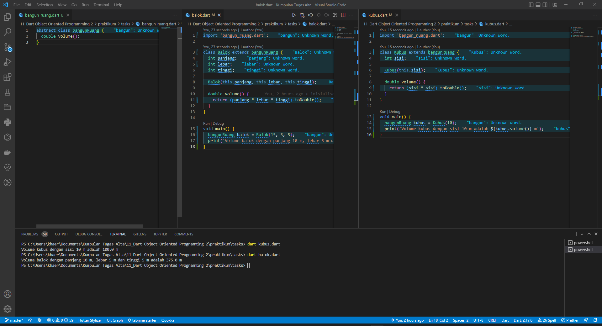

# (11) Dart Object Oriented Programming 2
## Data diri 
Nomor Peserta  : 1_013FLB_50   
Nama : Khaerul Latif

## Summary 
Section 11 ini saya belajar tentang Dart Object Oriented Programming 2, diantaranya:
1. Abstraction, objek hanya menunjukkan operasinya secara high-level. Cukup tau method apa saja yang dibuat oleh class tersebut.
2. Inheritance, mewarisi properti kelas induk (parent class) ke kelas anak (child class). 
3. Polymorphism, objek class dapat memiliki bentuk atau implementasi yang berbeda-beda pada satu metode yang sama.
## Task
### Task 01, Task 02, Task 03 & Task 04
Membuat beberapa class balok, kubus dan bangun_ruang(abstract), melakukan 

