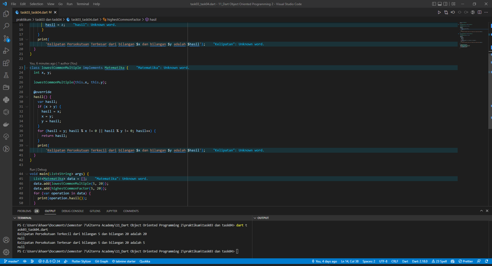

# (11) Dart Object Oriented Programming 2
## Data diri 
Nomor Peserta : 1_013FLB_50  <br />
Nama Peserta : Khaerul Latif

## Summary 
Section 11 ini saya belajar tentang Dart Object Oriented Programming 2, diantaranya:
1. Abstraction, objek hanya menunjukkan operasinya secara high-level. Cukup tau method apa saja yang dibuat oleh class tersebut.
2. Inheritance, mewarisi properti kelas induk (parent class) ke kelas anak (child class). 
3. Polymorphism, objek class dapat memiliki bentuk atau implementasi yang berbeda-beda pada satu metode yang sama.

## Task
### Task 01
**Membuat class bangunRuang, kubus dan balok. dimana class bangun ruang menurunkan class kubus dan class balok**
```dart
abstract class bangunRuang {
  int panjang, lebar, tinggi;
  bangunRuang(this.panjang, this.lebar, this.tinggi);
  volume();
}
```
diatas proses membuat metode volume, membuat constructor panjang, lebar, tinggi bertipe data integer

```dart
int sisi;
Kubus(this.sisi) : super(0, 0, 0);
```
diatas proses membuat variable constructor dengan nama variabel sisi dan tipe datanya integer di class Kubus. constructor super class(bangunRuang) bernilai 0;

```dart
int sisi;
Balok(super.panjang, super.lebar, super.tinggi);
```
diatas proses menjadikan variable super constuctor dengan nama variabel panjang, lebar, dan tinggi dan tipe datanya integer di class bangunRuang

```dart
class Balok extends bangunRuang {
  @override
  volume() {
    print('Hasil Volume Baloknya adalah ${panjang * lebar * tinggi}');
  }
}
```
diatas proses menurunkan metode volume yang terdapat pada class bangunRuang ke dalam class balok, metode volume berisi proses

```dart
class Kubus extends bangunRuang {
  @override
  volume() {
    print('Hasil Volume Kubusnya adalah ${sisi * sisi * sisi}');
  }
}
```
diatas proses menurunkan metode volume yang terdapat pada class bangunRuang ke dalam class kubus, metode volume berisi proses

### Task 02
**Membuat obejct yang berisi parameter pada kelas balok dan kubus**
```dart
List<bangunRuang> data = [];
```
diatas proses membuat variabel list kosong yang menamai data

```dart
data.add(Balok(2, 4, 5));
data.add(Kubus(6));
```
diatas proses menambahkan list ke dalam variable data, yang berisi nama kelas turunan dengan beberapa parameter

```dart
for (var bangun in data) {
    print(bangun.volume());
  }
```
diatas proses menggunakan proses perulangan pada variable bangun yang berisi metode volume

Berikut adalah codingan dan runnya task 01 dan task 02


### Task 03
**Membuat class Matematika, lowestCommonMultiple dan balok. dimana class bangun ruang menurunkan class kubus dan class balok**
```dart
abstract class Matematika {
  hasil();
}
```
diatas proses membuat metode volume, membuat constructor panjang, lebar, tinggi bertipe data integer

```dart
int x, y;
highestCommonFactor(this.x, this.y);
```
diatas proses membuat variable constructor dengan nama variabel x, y dan tipe datanya integer di class highestCommonFactor.

```dart
int x, y;
lowestCommonMultiple(this.x, this.y);
```
diatas proses membuat variable constructor dengan nama variabel x, y dan tipe datanya integer di class lowestCommonMultiple.

```dart
class highestCommonFactor implements Matematika {
  @override
  hasil() {
    var hasil;
    for (var z = 1; z <= x; z++) {
      if (x % z == 0 && y % z == 0) {
        hasil = z;
      }
    }
    print(
        'Kelipatan Persekutuan Terbesar dari bilangan $x dan bilangan $y adalah $hasil');
  }
}
```
diatas proses menurunkan metode hasil yang terdapat pada class Matematika ke dalam class highestCommonFactor, metode hasil berisi proses

```dart
class lowestCommonMultiple implements Matematika {
  @override
  hasil() {
    var hasil;
    if (x > y) {
      hasil = x;
      x = y;
      y = hasil;
    }
    for (hasil = y; hasil % x != 0 || hasil % y != 0; hasil++) {
      return hasil;
    }
    print(
        'Kelipatan Persekutuan Terkecil dari bilangan $x dan bilangan $y adalah $hasil');
  }
}
```
diatas proses menurunkan metode hasil yang terdapat pada class Matematika ke dalam classlowestCommonMultiple, metode hasil berisi proses

### Task 04
**Membuat obejct yang berisi parameter pada kelas balok dan kubus**
```dart
List<Matematika> data = [];
```
diatas proses membuat variabel list kosong yang menamai data

```dart
data.add(lowestCommonMultiple(5, 20));
data.add(highestCommonFactor(5, 20));
```
diatas proses menambahkan list ke dalam variable data, yang berisi nama kelas turunan dengan beberap parameter

```dart
for (var operation in data) {
    print(operation.hasil());
  }
```
diatas proses menggunakan proses perulangan pada variable operation yang berisi metode hasil

Berikut adalah codingan dan runnya task 03 dan task 04


### Task 05
**Struktur class sebagai berikut**


```dart
class Hewan {
  String nama, jenis;
  Hewan(this.nama, this.jenis);

  void suara() { }
}

class Unggas extends Hewan {
  String keluarga;
  Unggas(super.nama, super.jenis, this.keluarga) {
    print(
        '$nama termasuk unggas berjenis $jenis dan termasuk dalam keluarga $keluarga');
  }
}

class Kucing extends Hewan {
  Kucing(super.nama, super.jenis);

  void lari() {
    print(
        'Nama Kucing adalah $nama, kucing tersebut berjenis $jenis. sedang berjalan-jalan di area komplek');
  }

  @override
  void suara() {
    print(
        '$nama bersuara meow ketika sedang lapar. $nama kucing berjenis $jenis');
  }
}

class Burung extends Unggas {
  Burung(super.nama, super.jenis, super.keluarga);
  @override
  void suara() {
    print('Nama burung itu adalah $nama, ia burung berjenis $jenis dan termasuk dalam keluarga $keluarga, iya berbunyi Krak krak');
  }
  void terbang() {
    print(
        '$nama sering terbang mengitari komplek. $nama termasuk burung berjenis $jenis dan termasuk dalam keluarga $keluarga');
  }
}
```
Berikut adalah codingan dan runnya task 05


### Task 06
**Struktur class sebagai berikut dan membuat constructor sebagai berikut**


```dart
abstract class Manusia {
  String nik, nama, alamat;
  Manusia(this.nik, this.nama, this.alamat);

  belajar();
}

class Mahasiswa extends Manusia {
  Mahasiswa(super.nik, super.nama, super.alamat);

  @override
  belajar() {
    print('Mahasiswa $nama dengan $nik beralamat di $alamat, sedang belajar');
  }

  void nikMhs() {
    print('12879173712893712');
  }

  void prodiMhs() {
    print('Teknik Informatika');
  }

  void ipkMhs() {
    print('3.1');
  }

  void jadwal() {
    print('senin - minggu');
  }

  void jadwalMhs() {
    print('Pemrograman Dasar');
  }
}

class Dosen extends Manusia {
  Dosen(super.nik, super.nama, super.alamat);

  @override
  belajar() {
    print('Dosen $nama dengan $nik beralamat di $alamat, sedang belajar');
  }

  void nidn() {
    print('12879173712893712');
  }

  void jabatanFung() {
    print('Asisten rektor');
  }

  void pangkat() {
    print('Epic');
  }

  void jadwalDsn() {
    print('Senin - Jumat');
  }
}
```
Berikut adalah codingan dan runnya task 06
