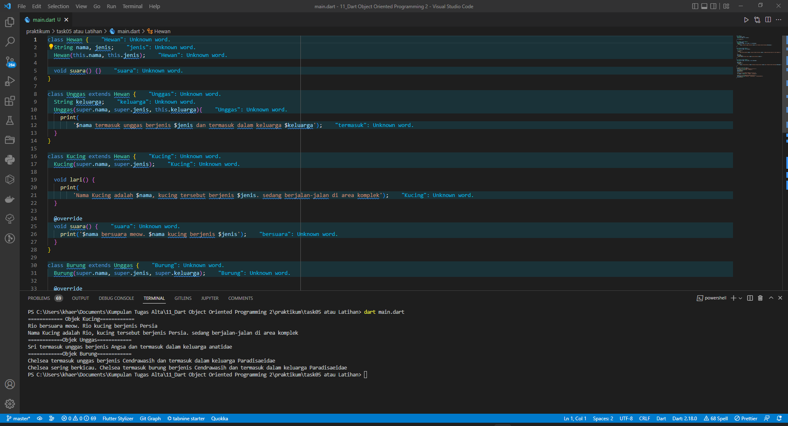

# (11) Dart Object Oriented Programming 2
## Data diri 
Nomor Peserta  : 1_013FLB_50  <br />
Nama : Khaerul Latif

## Summary 
Section 11 ini saya belajar tentang Dart Object Oriented Programming 2, diantaranya:
1. Abstraction, objek hanya menunjukkan operasinya secara high-level. Cukup tau method apa saja yang dibuat oleh class tersebut.
2. Inheritance, mewarisi properti kelas induk (parent class) ke kelas anak (child class). 
3. Polymorphism, objek class dapat memiliki bentuk atau implementasi yang berbeda-beda pada satu metode yang sama.
## Task
### Task 01
**Membuat class bangunRuang, kubus dan balok. dimana class bangun ruang menurunkan class kubus dan class balok**
```dart
abstract class bangunRuang {
  double volume();
}
```
diatas proses membuat metode volume dengan tipe data double di kelas bangunRuang dan di file 'bangun_ruang.dart'

```dart
import 'bangun_ruang.dart';

```
diatas proses mengimport ke file 'balok.dart' dan 'kubus.dart'

```dart
int sisi;
Kubus(this.sisi);
```
diatas proses membuat variable constuctor dengan nama variabel sisi dan tipe datanya integer di class Kubus

```dart
int sisi;
Balok(this.panjang, this.lebar, this.tinggi);
```
diatas proses membuat variable constuctor dengan nama variabel panjang, lebar, dan tinggi dan tipe datanya integer di class Balok

```dart
class Balok extends bangunRuang {
    @override
    double volume() {
        return (panjang * lebar * tinggi).toDouble();
  }
}
```
diatas proses menurunkan metode volume yang terdapat pada class bangunRuang ke dalam class balok, kemudian hasil dari metode volume di ubah ke tipe data double

```dart
class Kubus extends bangunRuang {
    @override
    double volume() {
        return (sisi * sisi).toDouble();
    }
}
```
diatas proses menurunkan metode volume yang terdapat pada class bangunRuang ke dalam class kubus, kemudian hasil dari metode volume di ubah ke tipe data double

### Task 02
**Membuat obejct yang berisi parameter pada kelas balok dan kubus**
```dart
bangunRuang balok = Balok(15, 5, 5);
print(balok.volume());
```
diatas proses membuat object variabel balok dengan tipe data bangunRuang dan memberi nilai / parameter yang ada pada kelas Balok

```dart
bangunRuang kubus = Kubus(10);
print(kubus.volume());
```
diatas proses membuat object variabel kubus dengan tipe data bangunRuang dan memberi nilai / parameter yang ada pada kelas kubus

Berikut adalah codingan dan runnya task 01 dan task 02


### Task 03
**Membuat class bangun ruang, kubus dan balok. dimana class bangun ruang menurunkan class kubus dan class balok**
abstract class Matematika {
  hasil();
}
```
diatas proses membuat metode hasil di kelas Matematika dan di file 'matematika.dart'

```dart
import 'matematika.dart';
```
diatas proses mengimport ke file 'balok.dart' dan 'kubus.dart'

```dart
int x, y;
highestCommonFactor(this.x, this.y);
```
diatas proses membuat variable constuctor dengan nama variabel x dan y,serta tipe datanya integer di class highestCommonFactor

```dart
int x, y;
lowestCommonMultiple(this.x, this.y);
```
diatas proses membuat variable constuctor dengan nama variabel x dan y,serta tipe datanya integer di class lowestCommonMultiple

```dart
class highestCommonFactor implements Matematika {

  @override
  hasil() {
    var hasil;
    for (var z = 1; z <= x; z++) {
      if (x % z == 0 && y % z == 0) {
        hasil = z;
      }
    }
    print('Kelipatan Persekutuan Terbesar dari bilangan $x dan bilangan $y adalah $hasil');
  }
}
```
diatas proses menurunkan metode hasil yang terdapat pada class Matematika ke dalam class highestCommonFactor, kemudian methode hasil berisi rumus untuk menghitung Kelipatan Persekutuan Terbesar

```dart
class lowestCommonMultiple implements Matematika {

  @override
  hasil() {
    var hasil;
    if (x > y) {
      hasil = x;
      x = y;
      y = hasil;
    }
    for (hasil = y; hasil % x != 0 || hasil % y != 0; hasil++) {
      return hasil;
    }
    print('Kelipatan Persekutuan Terkecil dari bilangan $x dan bilangan $y adalah $hasil');
  }
}
```
diatas menurunkan metode hasil yang terdapat pada class Matematika ke dalam class lowestCommonMultiple, kemudian methode hasil berisi rumus untuk menghitung Kelipatan Persekutuan Terkecil

### Task 04
**Membuat obejct yang berisi parameter pada kelas highestCommonFactor dan lowestCommonMultiple**
```dart
Matematika operation = highestCommonFactor(5, 20);
print(operation.hasil());
```
diatas proses membuat object variabel operation dengan tipe data class Matematika dan memberi nilai / parameter yang ada pada kelas highestCommonFactor

```dart
Matematika operation = lowestCommonMultiple(5, 20);
print(operation.hasil());
```
diatas proses membuat object variabel operation dengan tipe data class Matematika dan memberi nilai / parameter yang ada pada kelas lowestCommonMultiple

Berikut adalah codingan dan runnya task 03 dan task 04

### Task 05
```dart
class Hewan {
  String nama, jenis;
  Hewan(this.nama, this.jenis);

  void suara() {}
}
```
Membuat kelas Hewan sebagai kelas Parents, serta berisi constructor nama dan jenis. dan membuat metode suara

```dart
class Unggas extends Hewan {
  String keluarga;
  Unggas(String nama, String jenis, this.keluarga) : super(nama, jenis) {
    print(
        '$nama termasuk unggas berjenis $jenis dan termasuk dalam keluarga $keluarga');
  }
}
```
diatas proses Membuat kelas Unggas sebagai turunan dari kelas Hewan(kelas Parents), serta berisi constructor turunan dari kelas Hewan dan menambahkan constructor keluarga yang bertipe data String
```dart
class Kucing extends Hewan {
  Kucing(super.nama, super.jenis);

  void lari() {
    print(
        'Nama Kucing adalah $nama, kucing tersebut berjenis $jenis. sedang berjalan-jalan di area komplek');
  }

  @override
  void suara() {
    print('$nama bersuara meow. $nama kucing berjenis $jenis');
  }
}
```
diatas proses Membuat kelas Kucing sebagai turunan dari kelas Hewan(kelas Parents), serta berisi constructor dan method turunan dari kelas Hewan dan menambahkan methode lari
```dart
class Burung extends Unggas {
  Burung(super.nama, super.jenis, super.keluarga);

  @override
  void suara() {
    print(
        '$nama sering berkicau. $nama termasuk burung berjenis $jenis dan termasuk dalam keluarga $keluarga');
  }
}
```
diatas proses Membuat kelas Burung sebagai turunan dari kelas Unggas(kelas Child), serta berisi constructor dan method turunan dari kelas Unggas dan menambahkan.

```dart
print('============ Objek Kucing============');
var kucing = Kucing('Rio', 'Persia');
kucing.suara();
kucing.lari();
```
diatas proses Membuat Object kucing dari kelas kucing yang berisi 2 parameter pertipe data String, serta memanggil methode suara dan lari.

```dart
print('============Objek Unggas============');
var unggas = Unggas('Sri', 'Angsa', 'anatidae');
```
diatas proses Membuat Object unggas dari kelas unggas yang berisi 3 parameter pertipe data String

```dart
print('============Objek Burung============');
var burung = Burung('Chelsea', 'Cendrawasih', 'Paradisaeidae');
burung.suara();
```
diatas proses Membuat Object burung dari kelas burung yang berisi 3 parameter pertipe data String, serta memmanggil methode suara

Berikut adalah codingan dan runnya task 03 dan task 04
