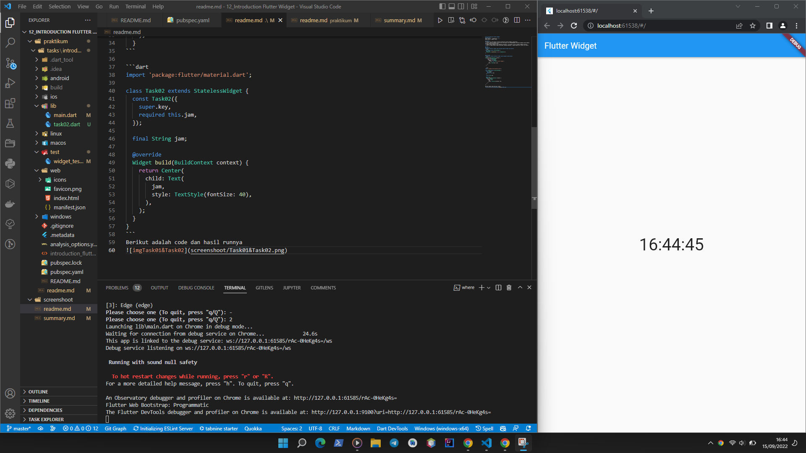

# (12) Introduction Flutter Widget
## Data diri 
Nomor Peserta : 1_013FLB_50  <br />
Nama Peserta : Khaerul Latif

## Summary 
Section 12 ini saya belajar tentang Introduction Flutter Widget, diantaranya:
1. Flutter adalah framework yang di buat oleh google untuk mengembangkan antarmuka pengguna dalam membuat aplikasi mobile,desktop dan web
2. Widget adalah komponen untuk membentuk antarmuka / UI aplikasi, bisa di katakan sebagai blueprint 
3. Built in widget adalah widget yang dapat langsung digunakan / widget bawaan dari flutter itu sendiri

## Task
### Task 01
**Membuat statefull widget yang kontennya dapat berubah tiap detik**
```dart
class MyApp extends StatefulWidget {
  @override
  _MyAppState createState() => new _MyAppState();
} 
```

### Task 02
**Memisahkan menjadi beberapa widget tanpa mengubah tampilannya**
```dart 
Widget build(BuildContext context) {
    return new MaterialApp(
      home: new Scaffold(
        appBar: new AppBar(
          title: const Text('Flutter Widget')
        ),
        body: Task02(jam: jam),
      ),
    );
  }
```

```dart
import 'package:flutter/material.dart';

class Task02 extends StatelessWidget {
  const Task02({
    super.key,
    required this.jam,
  });

  final String jam;

  @override
  Widget build(BuildContext context) {
    return Center(
      child: Text(
        jam,
        style: TextStyle(fontSize: 40),
      ),
    );
  }
}
```
Berikut adalah code dan hasil runnya
