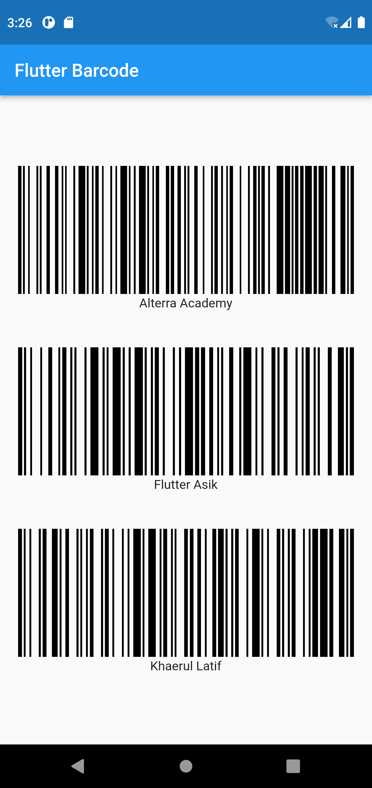

# (14) Flutter Command Line Interface (CLI) and Flutter package management
## Data diri 
Nomor Peserta : 1_013FLB_50  <br />
Nama Peserta : Khaerul Latif

## Summary 
Section 14 ini saya belajar tentang Flutter Command Line Interface (CLI) and Flutter package management, diantaranya:
1. Flutter Create
Perintah create ini biasa digunakan untuk membuat project baru dengan Flutter. Perintah yang biasa digunakan seperti <br />
2. Flutter Doctor
Setiap saat butuh mengecek default konfigurasi yang digunakan untuk menggunakan flutter SDK ini. <br />
3. Flutter Upgrade
Flutter juga selalu mendapatkan update terbaru untuk mendapatkan peningkatan kinerja dari Google untuk Flutter SDK selalu bekerja secara efisien dan cepat. Flutter akan menampilkan selalu tampilan untuk mengupdate flutter version, bilamana terdapat Flutter SDK dengan versi terbaru. <br />
4. Flutter Pub
Perintah Pub pad Flutter digunakan untuk mengatur package yang terdapat diFlutter. Didalam perintah ini terdapat masih terdapt subcommands yang dapat digunakan seperti cache, deps, downgrade, get, global, dan lain lain. <br />

## Task
### Task 01
A. Menggunakkan package [https://pub.dev/packages/badges](https://pub.dev/packages/badges)
```dart
import 'package:badges/badges.dart';
```
diatas proses mengimport bagdes dan badges widget ke dalam file main.dart


B. Membuat Tampilan dari package badges
```dart
 Chip(
	padding: EdgeInsets.all(0),
	backgroundColor: Colors.deepPurple,
	label: Text('BADGE', style: TextStyle(color: Colors.white)),
	),
Badge(
	toAnimate: false,
	shape: BadgeShape.square,
	badgeColor: Colors.deepPurple,
	borderRadius: BorderRadius.circular(8),
	badgeContent: Text('BADGE', style: TextStyle(color: Colors.white)),
	),
```
diatas proses membuat tampilan badges di dalam file main.dart

### Task 02
A. Menggunakkan package [https://pub.dev/packages/barcode_widget](https://pub.dev/packages/barcode_widget)
```dart
import 'package:barcode_widget/barcode_widget.dart';
```
B. Membuat tampilan barcode
- Alterra Academy
- Flutter Asik
- Khaerul Latif
```dart
SizedBox(
    width: 120.0,
    height: 80.0,
    child: BarcodeWidget(
        barcode: Barcode.qrCode(
          errorCorrectLevel: BarcodeQRCorrectionLevel.high,
    ),
    data: 'Alterra Academy',
    width: 80,
    height: 80,
    ),
),
SizedBox(
    width: 120.0,
    height: 80.0,
    child: BarcodeWidget(
        barcode: Barcode.qrCode(
          errorCorrectLevel: BarcodeQRCorrectionLevel.high,
    ),
    data: 'Flutter Asik',
    width: 80,
    height: 80,
    ),
),
SizedBox(
    width: 120.0,
    height: 80.0,
    child: BarcodeWidget(
        barcode: Barcode.qrCode(
          errorCorrectLevel: BarcodeQRCorrectionLevel.high,
    ),
    data: 'Khaerul Latif',
    width: 80,
    height: 80,
    ),
),
```
Hasil dari Task 01 dan Task 02 : 
## Output Task01


## Output Task02
