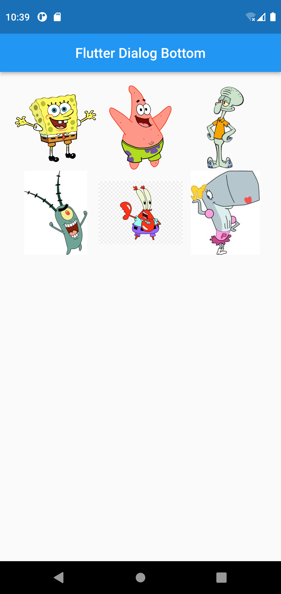
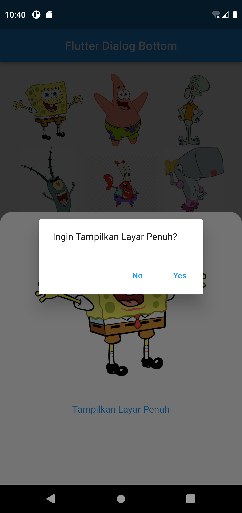

# (16) Assets
## Data diri 
Nomor Peserta : 1_013FLB_50  <br />
Nama Peserta : Khaerul Latif

## Summary 
Section 16 ini saya belajar tentang Assets, diantaranya:
1. Assets adalah file yang dibundel dan di-deploy dengan aplikasi Anda, dan dapat diakses saat runtime. Jenis assets yang umum mencakup data statis (misalnya, file JSON), file konfigurasi, ikon, dan gambar (JPEG, WebP, GIF, WebP/GIF animasi, PNG, BMP, dan WBMP).
2. Images sendiri adalah bagian dari assets Flutter.
3. Font adalah salah satu bagian yang sangat diperhatikan dan memiliki pengaruh besar terhadap tamplian aplikasi.

## Task
### Task 01
**Membuat gridview berupa 6 gambar gambar dari internet**
```dart
List<String> gambar = [
    'https://www.kibrispdr.org/data/786/pics-of-spongbob-12.jpg',
    'https://logos-download.com/wp-content/uploads/2016/09/Patrick_Star_picture_logo-520x700.png',
    'https://static.tvtropes.org/pmwiki/pub/images/squidward_tentacles_91.png',
    'https://i.pinimg.com/236x/e1/46/2e/e1462ebce4e7f0c22a2df04275452146.jpg',
    'https://i.pinimg.com/originals/07/4b/d7/074bd7dfc19abf84f5cd6cb70619c703.jpg',
    'https://fbface.files.wordpress.com/2013/01/b5d4a-pearl.jpg',
];
```
diatas proses membuat list untuk menyimpan url gambar dari internet

```dart
GridView.builder(
        gridDelegate: const SliverGridDelegateWithFixedCrossAxisCount(
          crossAxisCount: 3,
          mainAxisSpacing: 1,
          crossAxisSpacing: 1,
        ),
        padding: EdgeInsets.all(20),
        itemCount: gambar.length,
        itemBuilder: (context, index) {
          return InkWell(
            onTap: () {
              showModalBottomSheet(
                shape: const RoundedRectangleBorder(
                    borderRadius:
                        BorderRadius.vertical(top: Radius.circular(20))),
                context: context,
                builder: (context) =>
                    ImageBottomSheets(gambarBottom: gambar[index]),
              );
            },
            child: Image.network(gambar[index]),
          );
        },
      ),
```
diatas proses menampilkan gridview dari list yang sudah dibuat

**Hasil Output Task01**


### Task 02
**Menambahkan fungsi saat ditekan akan membuat halaman baru, halaman tersebut bisa di perbesar**
```dart
 TextButton(
                    onPressed: (){
                      Navigator.push(
                        context, MaterialPageRoute(
                          builder: (context) => FullScreen(
                            gambarFull: gambarBottom
                          ),
                        ),
                      );
                    },
                    child: const Text('Yes'),
                  ),
```
proses diatas adalah ketika user mengklik 'Yes' maka gambar akan full, yang dimana proses gambar full tersebut terletak di Class FullScreen

**Hasil Output Task02**

.png)
.png)